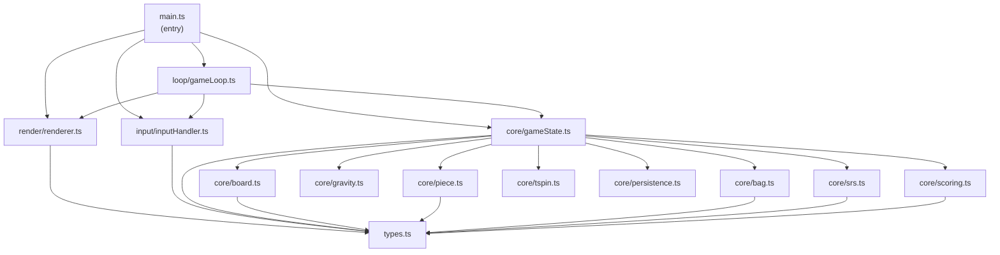
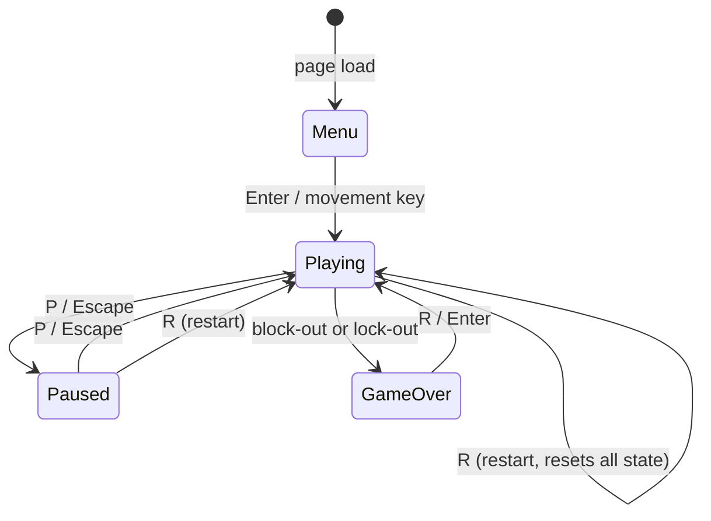

# Tetris Clone — Design Document

**Revision**: 1.0  
**Date**: 2026-09-21  
**Stack**: TypeScript (strict), Vite, HTML5 Canvas 2D, Vitest, ESLint + Prettier

---

## 1. High-Level Architecture

The codebase is split into four strictly-separated layers. The `core/` layer contains zero DOM access and zero side effects — it is composed entirely of pure functions operating on plain data objects. All state mutation flows through `core/` only. The other layers are consumers of that state.

```
src/
├── core/           # Pure game logic (no DOM)
│   ├── board.ts
│   ├── piece.ts
│   ├── bag.ts
│   ├── srs.ts
│   ├── gravity.ts
│   ├── scoring.ts
│   ├── tspin.ts
│   ├── gameState.ts
│   └── persistence.ts
├── input/          # Keyboard + DAS/ARR state machine
│   └── inputHandler.ts
├── render/         # Canvas 2D renderer (read-only on state)
│   └── renderer.ts
├── loop/           # rAF + fixed-timestep accumulator
│   └── gameLoop.ts
├── types.ts        # All shared TypeScript interfaces/types
├── constants.ts    # Magic-number–free constants
└── main.ts         # Entry point: wires everything together
```

---

## 2. Module Dependency Graph



---

## 3. Game State Machine



**State invariants**:
- `Paused`: gravity timer, lock-delay timer, DAS/ARR timers, and line-clear animation timer are all suspended. Input still registered but not acted upon.
- `GameOver`: loop still calls `requestAnimationFrame` (to keep the screen alive) but no game logic runs.
- `Menu`: no active piece; high score displayed.

---

## 4. TypeScript Interfaces

All interfaces live in `src/types.ts`.

```typescript
// ─── Cell ───────────────────────────────────────────────────────────────────

/** A cell on the board. Empty = 0; piece type uses PieceType. */
export type CellType = 0 | PieceType;

// ─── Piece ──────────────────────────────────────────────────────────────────

export type PieceType = 'I' | 'O' | 'T' | 'S' | 'Z' | 'J' | 'L';

export interface Piece {
  type: PieceType;
  rotation: 0 | 1 | 2 | 3;   // 0=spawn, 1=CW, 2=180, 3=CCW
  x: number;                   // column of top-left of bounding box
  y: number;                   // row of top-left of bounding box (0 = hidden row 0)
}

// ─── Board ──────────────────────────────────────────────────────────────────

/** 22 rows × 10 cols. Row 0 and 1 are hidden spawn rows. */
export type Board = CellType[][];

// ─── Input ──────────────────────────────────────────────────────────────────

export type InputAction =
  | 'MOVE_LEFT'
  | 'MOVE_RIGHT'
  | 'SOFT_DROP'
  | 'HARD_DROP'
  | 'ROTATE_CW'
  | 'ROTATE_CCW'
  | 'HOLD'
  | 'PAUSE'
  | 'RESTART'
  | 'START';

// ─── Scoring ────────────────────────────────────────────────────────────────

export type TSpin = 'none' | 'mini' | 'full';

export interface ScoreEvent {
  linesCleared: number;
  tSpin: TSpin;
  isBackToBack: boolean;
  combo: number;          // current combo count (−1 means no combo)
  softDropCells: number;
  hardDropCells: number;
  level: number;
}

// ─── Lock Delay ─────────────────────────────────────────────────────────────

export interface LockDelayState {
  active: boolean;
  timer: number;          // ms remaining
  resetCount: number;     // number of resets used this placement
}

// ─── DAS / ARR ──────────────────────────────────────────────────────────────

export interface DASState {
  direction: 'left' | 'right' | null;
  dasTimer: number;       // ms until ARR kicks in
  arrTimer: number;       // ms until next ARR movement
  active: boolean;        // true once DAS threshold crossed
}

// ─── Line Clear Animation ────────────────────────────────────────────────────

export interface LineClearAnimation {
  rows: number[];         // row indices being cleared
  timer: number;          // ms remaining (starts at ~200)
}

// ─── Full Game State ─────────────────────────────────────────────────────────

export type GamePhase = 'menu' | 'playing' | 'paused' | 'gameover';

export interface GameState {
  phase: GamePhase;

  board: Board;
  activePiece: Piece | null;
  ghostY: number;           // pre-computed ghost landing row

  holdPiece: PieceType | null;
  holdUsed: boolean;

  nextQueue: PieceType[];   // always maintained at length ≥ 5

  score: number;
  highScore: number;
  level: number;
  lines: number;
  combo: number;            // −1 = no active combo

  isBackToBack: boolean;    // true if last scoring action was Tetris/T-spin

  lockDelay: LockDelayState;
  gravityTimer: number;     // ms until next gravity drop

  lineClearAnim: LineClearAnimation | null;

  // Last rotation info needed for T-spin detection
  lastActionWasRotation: boolean;
  lastKickIndex: number;    // which kick offset was used (0 = no kick)
}
```

---

## 5. Core Module Contracts

### 5.1 `core/board.ts`
```typescript
createBoard(): Board
// Returns a 22×10 grid filled with 0.

isRowFull(board: Board, row: number): boolean
// Returns true if every cell in the row is non-zero.

clearRows(board: Board, rows: number[]): Board
// Returns a new board with the specified rows removed and empty rows prepended.

placePiece(board: Board, piece: Piece): Board
// Returns a new board with the piece's cells stamped onto it.
```

### 5.2 `core/piece.ts`
```typescript
PIECE_SHAPES: Record<PieceType, number[][][]>
// 4 rotation states per piece, each state is a list of [row, col] offsets.

PIECE_COLORS: Record<PieceType, string>
// Hex color strings.

getBlocks(piece: Piece): [number, number][]
// Returns the absolute [row, col] positions of the piece's 4 cells.

spawnPiece(type: PieceType): Piece
// Returns a piece at the standard spawn position, rotation 0.
```

### 5.3 `core/bag.ts`
```typescript
createBag(seed: number): BagState
// Returns initial bag state using the given seed.

nextPiece(bag: BagState): [PieceType, BagState]
// Returns the next piece type and updated bag state (pure).

// BagState is an opaque struct containing the RNG state and remaining bag items.
```

### 5.4 `core/srs.ts`
```typescript
KICKS_JLSTZ: KickTable   // indexed by [fromRotation][toRotation]
KICKS_I: KickTable

tryRotate(board: Board, piece: Piece, dir: 'cw' | 'ccw'): Piece | null
// Returns the rotated piece (with kick applied) or null if all offsets fail.
// Does NOT mutate; returns a new Piece.
```

### 5.5 `core/gravity.ts`
```typescript
gravityInterval(level: number): number
// Returns milliseconds per row. Formula: (0.8-(level-1)*0.007)^(level-1) * 1000

computeGhostY(board: Board, piece: Piece): number
// Returns the lowest Y the piece can occupy without collision.
```

### 5.6 `core/scoring.ts`
```typescript
computeScore(event: ScoreEvent): number
// Returns the total points to award for this event (pure).

LINE_CLEAR_BASE: Record<number, number>  // 0→0, 1→100, 2→300, 3→500, 4→800
TSPIN_BASE: Record<number, number>       // 0→400, 1→800, 2→1200, 3→1600
MINI_TSPIN_BASE: Record<number, number>  // 0→100, 1→200
```

### 5.7 `core/tspin.ts`
```typescript
detectTSpin(board: Board, piece: Piece, lastActionWasRotation: boolean, kickIndex: number): TSpin
// Returns 'none', 'mini', or 'full'.
// Uses 3-corner rule on the T's bounding box corners.
// Mini: only 2 of 4 corners filled, or kick index ≥ 4 (last kick used).
```

### 5.8 `core/gameState.ts`
```typescript
createInitialState(highScore: number, seed: number): GameState
// Returns a fresh GameState ready for a new game.

tick(state: GameState, actions: InputAction[], deltaMs: number): GameState
// The single pure update function: applies input, gravity, lock delay,
// line clears, and scoring. Returns a new GameState.
// This is the heart of the core; all other core functions are helpers.
```

### 5.9 `core/persistence.ts`
```typescript
loadHighScore(): number
// Reads 'tetris-high-score' from localStorage; returns 0 on any error.

saveHighScore(score: number): void
// Writes to localStorage; swallows any errors.
```

---

## 6. Input Module

`input/inputHandler.ts` owns the DAS/ARR state machine entirely. It listens to `keydown`/`keyup` DOM events and produces an `InputAction[]` array each frame that is fed into `tick()`.

```
Key pressed ──► immediate action enqueued
               DAS timer starts (170ms)
                    │
                    ▼ (after 170ms)
              ARR timer starts (50ms)
                    │
                    ▼ (every 50ms)
              repeated action enqueued
```

The handler exposes:
```typescript
class InputHandler {
  constructor()
  drainActions(): InputAction[]   // called once per frame by the loop
  destroy(): void                  // removes event listeners
}
```

Key-to-action mapping is a plain constant table; no hard-coded strings scattered through logic.

---

## 7. Render Module

`render/renderer.ts` receives the current `GameState` and draws a full frame. It never calls `tick()` or modifies state.

Layout (logical pixels, scaled by DPR):
```
┌───────────────────────────────┐
│  HOLD  │   PLAYFIELD   │ NEXT │
│ [4×4]  │   [10×20]     │[4×4]│
│        │               │  ×5 │
│        │               │     │
│ SCORE  │               │     │
│ LEVEL  │               │     │
│ LINES  │               │     │
└───────────────────────────────┘
```

Total logical width = `HOLD_PANEL + PLAYFIELD + PREVIEW_PANEL`.  
Cell size derived from `Math.floor(availableHeight / 20)`.

Rendering steps per frame (in order):
1. Clear canvas
2. Draw playfield background grid
3. Draw locked board cells (skip rows in `lineClearAnim` using flash effect)
4. Draw ghost piece
5. Draw active piece
6. Draw hold panel
7. Draw preview queue
8. Draw HUD (score, high score, level, lines)
9. Draw overlay (Menu / Paused / GameOver screen)

---

## 8. Game Loop

`loop/gameLoop.ts` uses a fixed-timestep accumulator to decouple update frequency from render frequency:

```
lastTime = 0
accumulator = 0
FIXED_STEP = 16.667ms   (≈ 60 Hz update budget)

rAF callback(timestamp):
  raw_dt = timestamp - lastTime          (capped at 250ms to prevent spiral)
  lastTime = timestamp
  accumulator += raw_dt
  actions = inputHandler.drainActions()
  while accumulator >= FIXED_STEP:
    state = tick(state, actions, FIXED_STEP)
    actions = []                          (consume actions once)
    accumulator -= FIXED_STEP
  renderer.render(state, accumulator / FIXED_STEP)  // interpolation ratio passed
  requestAnimationFrame(callback)
```

---

## 9. SRS Kick Tables (verbatim constants)

These are defined in `src/core/srs.ts` as compile-time constants.

### JLSTZ Kick Table
```
// Offsets are [col_delta, row_delta] (col first, matching Tetris guideline convention)
KICKS_JLSTZ = {
  '0→1': [[ 0, 0], [-1, 0], [-1,+1], [ 0,-2], [-1,-2]],
  '1→2': [[ 0, 0], [+1, 0], [+1,-1], [ 0,+2], [+1,+2]],
  '2→3': [[ 0, 0], [+1, 0], [+1,+1], [ 0,-2], [+1,-2]],
  '3→0': [[ 0, 0], [-1, 0], [-1,-1], [ 0,+2], [-1,+2]],
  '1→0': [[ 0, 0], [+1, 0], [+1,-1], [ 0,+2], [+1,+2]],
  '2→1': [[ 0, 0], [-1, 0], [-1,+1], [ 0,-2], [-1,-2]],
  '3→2': [[ 0, 0], [-1, 0], [-1,-1], [ 0,+2], [-1,+2]],
  '0→3': [[ 0, 0], [+1, 0], [+1,+1], [ 0,-2], [+1,-2]],
}
```

### I-Piece Kick Table
```
KICKS_I = {
  '0→1': [[ 0, 0], [-2, 0], [+1, 0], [-2,-1], [+1,+2]],
  '1→2': [[ 0, 0], [-1, 0], [+2, 0], [-1,+2], [+2,-1]],
  '2→3': [[ 0, 0], [+2, 0], [-1, 0], [+2,+1], [-1,-2]],
  '3→0': [[ 0, 0], [+1, 0], [-2, 0], [+1,-2], [-2,+1]],
  '1→0': [[ 0, 0], [+2, 0], [-1, 0], [+2,+1], [-1,-2]],
  '2→1': [[ 0, 0], [+1, 0], [-2, 0], [+1,-2], [-2,+1]],
  '3→2': [[ 0, 0], [-2, 0], [+1, 0], [-2,-1], [+1,+2]],
  '0→3': [[ 0, 0], [-1, 0], [+2, 0], [-1,+2], [+2,-1]],
}
```

---

## 10. RNG Design

The seedable RNG uses a Mulberry32 algorithm (32-bit, fast, good distribution, no external deps):

```typescript
function mulberry32(seed: number): () => number {
  return function () {
    seed |= 0; seed = seed + 0x6D2B79F5 | 0;
    let t = Math.imul(seed ^ seed >>> 15, 1 | seed);
    t = t + Math.imul(t ^ t >>> 7, 61 | t) ^ t;
    return ((t ^ t >>> 14) >>> 0) / 4294967296;
  };
}
```

The `BagState` struct carries the RNG function and the remaining items in the current bag. Since it is a pure value passed through `tick()`, it can be snapshotted for test replay.

---

## 11. Coordinate System

- Row 0 is the **top** of the internal 22-row grid (hidden).
- Row 21 is the **bottom** of the internal grid (floor).
- Column 0 is the **left** edge.
- Piece `(x, y)` is the top-left corner of the piece's 4×4 bounding box.
- Positive Y direction is **downward** (matching canvas convention).

---

## 12. Ambiguities Resolved

| Topic | Decision |
|---|---|
| 180° rotation | Not in the guideline input set (no single-key 180). CW twice achieves it. |
| Mini T-spin criteria | Last-kick rule: if kick index 4 was used (final I offset), treat as mini; otherwise use 3-corner rule for full vs none. |
| O-piece spawn column | Col 4, matching Tetr.io guideline. |
| Gravity during lock delay | Gravity timer pauses while lock delay is active (standard guideline behavior). |
| ARR = 0 edge case | ARR of 50ms is fixed; instant ARR (0ms) is not supported to avoid infinite loops. |
| Line clear during animation | New piece does not spawn until animation completes; input is buffered. |

---

## 13. Test Strategy

| Area | Framework | Notes |
|---|---|---|
| All `core/` modules | Vitest | Pure functions; seeded RNG makes every bag/SRS test deterministic |
| SRS kicks | Vitest | One test per transition × all 5 offsets, plus wall-specific scenarios |
| Lock delay cap | Vitest | Simulate 16 moves, assert lock fires on 16th |
| Scoring table | Vitest | Every combination of lines × tspin × b2b × combo |
| Top-out conditions | Vitest | Block-out and lock-out scenarios |
| Input DAS/ARR | Vitest | Mock timers; assert action counts at t=0, t=169, t=170, t=220 |
| Renderer | Manual / visual | Canvas output not unit-tested; verified visually |
